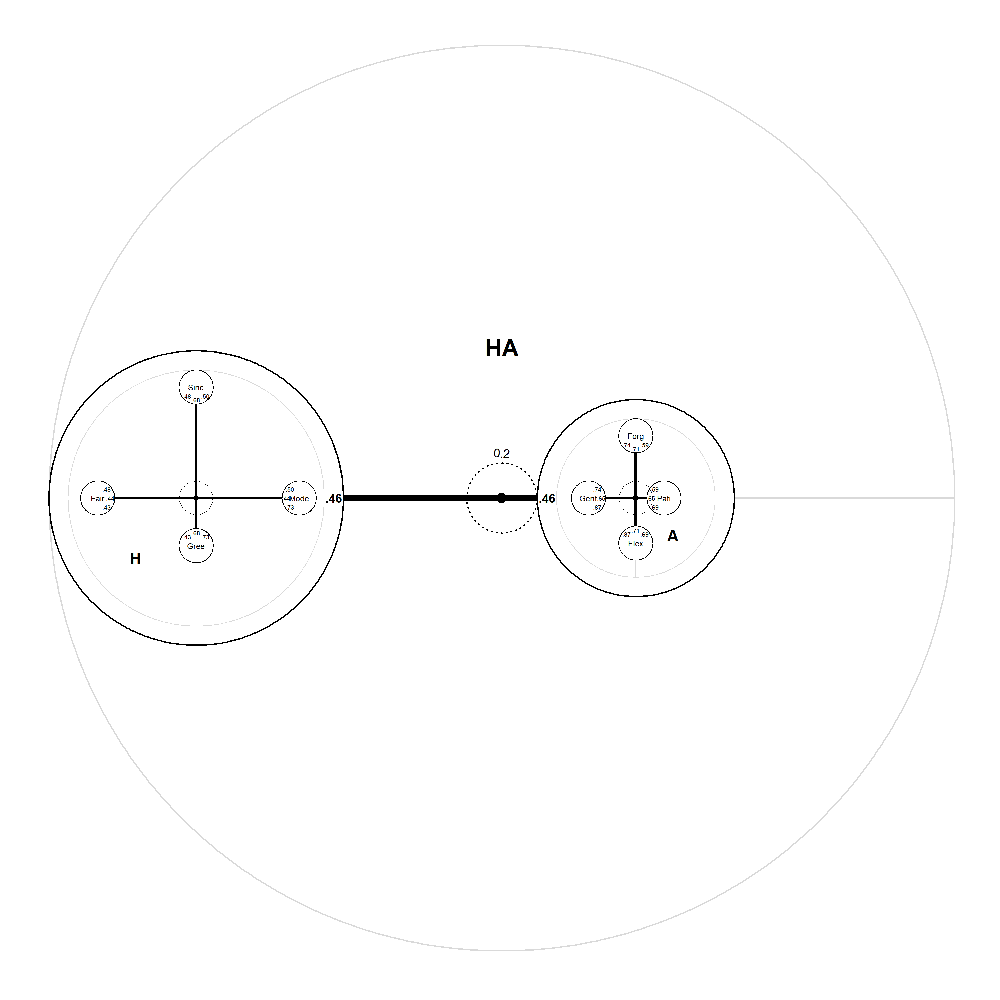

<!-- README.md is generated from README.Rmd. Please edit that file -->
IPV
===

<!-- badges: start -->
<!-- badges: end -->
The aim of IPV is to handily create item pool visualizations, as introduced in: [Dantlgraber, M., Stieger, S., & Reips, U. D. (2019). Introducing Item Pool Visualization: A method for investigation of concepts in self-reports and psychometric tests. Methodological Innovations, 12(3), 2059799119884283.](https://doi.org/10.1177/2059799119884283)

Installation
------------

You can install the released version of IPV from [CRAN](https://CRAN.R-project.org) by calling:

``` r
install.packages("IPV")
```

And the development version from [GitHub](https://github.com/) by calling:

``` r
# install.packages("devtools")
devtools::install_github("NilsPetras/IPV")
```

Usage
-----

This is an example how charts can be created:

``` r
library(IPV)

# read model estimates from excel files (manual input is also facilitated)
# Here, a toy example provided in the package is used.
# ?self_confidence
global <- system.file("extdata", "IPV_global.xlsx", package = "IPV", mustWork = TRUE)
tests <- c(system.file("extdata", "IPV_DSSEI.xlsx", package = "IPV", mustWork = TRUE),
             system.file("extdata", "IPV_SMTQ.xlsx", package = "IPV", mustWork = TRUE),
             system.file("extdata", "IPV_RSES.xlsx", package = "IPV", mustWork = TRUE))
x <- input_excel(global = global, tests = tests)
#> New names:
#> * `` -> ...1
#> Negative center distance adjusted to 0
#> New names:
#> * `` -> ...1
#> Negative center distance adjusted to 0
#> New names:
#> * `` -> ...1
#> Negative center distance adjusted to 0
#> New names:
#> * `` -> ...1

# create a nested chart (one of three available chart types)
nested_chart(x)
#> Facet circle radius set to 0.23 based on the data.
#> cor_spacing set to 0.224 based on the data.
#> Relative scaling set to 4.06 based on the data.
#> Axis tick set to 0.1 based on the data.
#> dist_construct_label set to 0.5 based on the data.
```



``` r
# the next step would be to customize the appearance
# ...
```

For further introduction, please check out the vignette.

``` r
browseVignettes("IPV")
#> starting httpd help server ... done
```

Citation
--------

When using item pool visualization, please cite:

Dantlgraber, M., Stieger, S., & Reips, U. D. (2019). Introducing Item Pool Visualization: A method for investigation of concepts in self-reports and psychometric tests. Methodological Innovations, 12(3), 2059799119884283.
